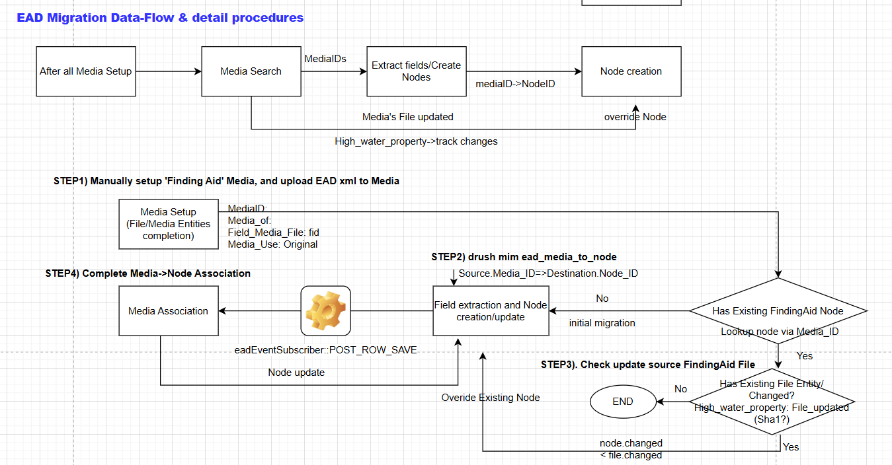

# EAD Migration

The module extracts Drupal media entities of type Finding Aid that contain EAD file attachments (in .xml format) and migrates them into repository item nodes in the modern Islandora site. For each Finding Aid media item, a corresponding new Drupal node entity is created during the migration. The migrated node is then linked back to the original Finding Aid media via the Media Of field.
To manage incremental updates, the module uses the file_updated timestamp of the attached media file as a high-water mark. Only media items whose attached file has a file_updated value greater than the current high‑water mark are imported or updated during migration.
## Usage
1. Install and enable the module in Drupal container
    - Install via composer: `composer require drupal/ead_migration`
    - Enable module via drush: `drush en -y ead_migration`
    - Confirm modules status: `drush pml --type=module --status=enabled | grep ead_migration`
2. Install and enable the module via Admin in UI
   - Goto Admin->Extend, search 'EAD Migration', and Click to install

## Migration dataflow
   -  
